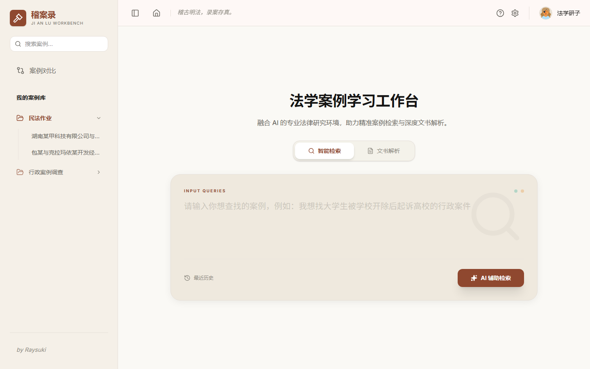
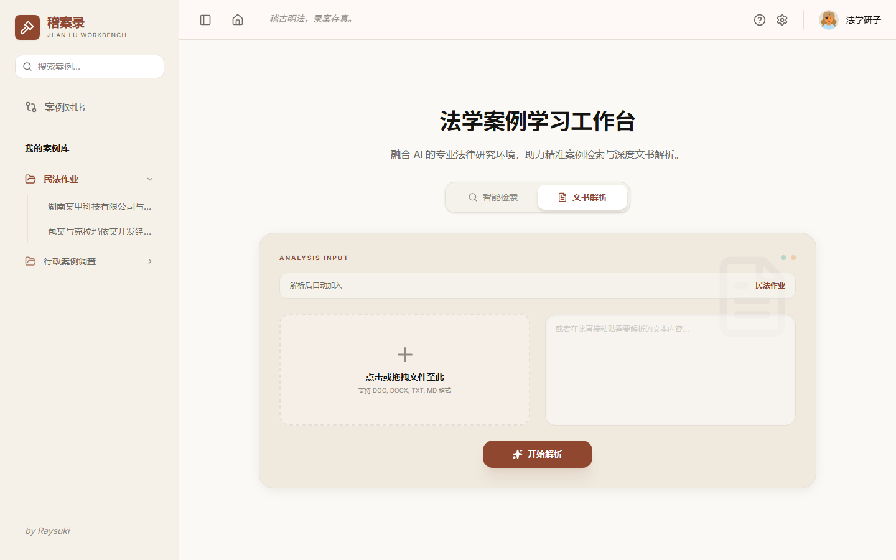
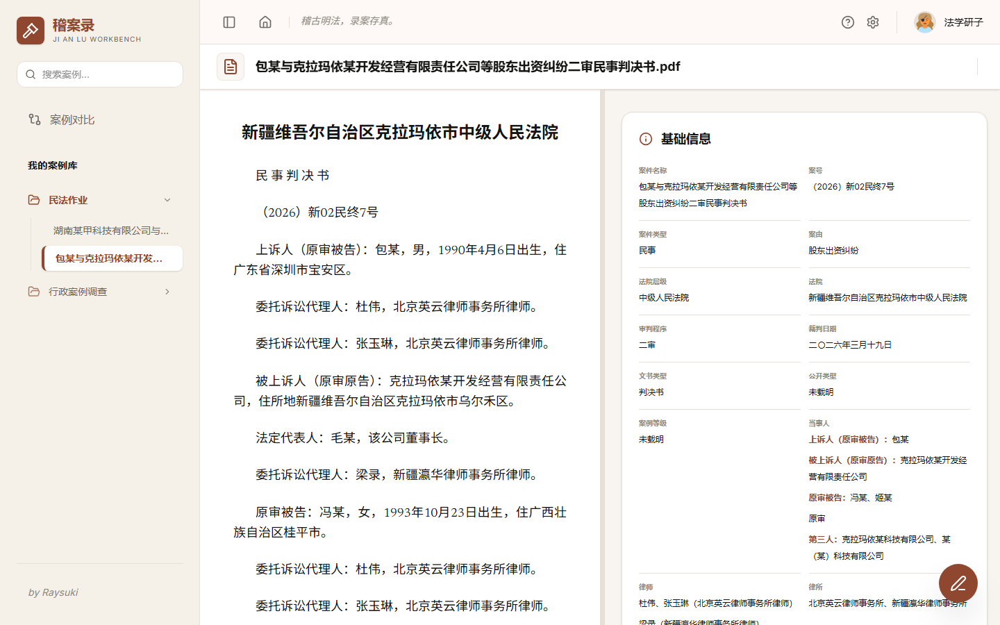

# LawHelper / 稽案录

“稽案录”（Ji An Lu Workbench）是一个面向法学研究和法律实务的小型本地案例解析工作台，目标是打通“检索 - 文书导入 - AI 结构化解析 - 案例库沉淀 - 笔记摘录”的个人工作流。

## 项目截图

### 智能检索入口



首页提供自然语言检索入口，可将用户输入的案例检索需求映射为裁判文书网检索条件，并保留历史检索与本地案例库导航。

### 文书解析入口



文书解析模块支持上传 Word、TXT、MD，也支持手动粘贴文本。后端会先提取正文，再调用 DeepSeek 生成结构化分析报告，并自动加入本地案例库。

### 案例阅读与解析工作台



案例详情页采用左右协同阅读方式，左侧管理案例库，主区域展示原文、基础信息、结构化报告和笔记入口，适合长文书审阅、摘录和复盘。

## 当前能力

- 智能检索：将自然语言检索需求映射为裁判文书网检索条件，并支持跳转网页执行检索。
- 文书解析：支持上传 Word、TXT、MD，也支持手动粘贴文本；后端提取正文后调用 DeepSeek 生成结构化分析报告。
- `.doc` 兼容：兼容传统 OLE Word、HTML 伪装 Word、以及 `.doc/.docx` 后缀误改导致的格式不一致问题。
- 本地案例库：解析结果自动进入本地 JSON 案例库，可按项目分类管理，支持案例重命名和删除。
- 结构化报告：按“基本案情、诉讼请求/控辩意见、争议焦点、法院认定事实、裁判理由、裁判结果、案例独特性”七个模块展示。
- 阅读与笔记：报告和原文双窗格浏览，支持划词复制、高亮、摘要和加入笔记；笔记可累计引用多段原文，引用作为正文段落保存。
- 本地部署：不依赖云服务器，适合个人或小范围分发使用。案例库默认保存在本机 `data/library.json`，该目录不会提交到 Git。

## 项目结构

- `src/`：裁判文书网检索、自然语言映射、浏览器接管等基础能力。
- `skills/`：OpenClaw/Codex skill 配置与说明。
- `稽案录/`：React + Vite 前端和本地 Express API。
- `稽案录/document-analysis.js`：文件文本提取和 AI 结构化解析。
- `稽案录/storage.js`：本地案例库读写。
- `稽案录/server.js`：检索、文书解析、案例库 API。

## 运行方式

根目录检索能力：

```bash
copy .env.example .env
npm install
npm run chrome:start
npm run search -- "股东未履行出资义务的民事一审案例"
```

稽案录工作台：

```bash
cd 稽案录
npm install
copy ..\.env .env
npm run dev
```

默认访问地址为 `http://localhost:3000/`，本地 API 地址为 `http://localhost:3001/`。

## 环境变量

在 `.env` 中配置：

```ini
DEEPSEEK_API_KEY=your_key_here
AI_BASE_URL=https://api.deepseek.com/v1
AI_MODEL=deepseek-v4-flash
```

`.env` 和 `data/` 已加入 `.gitignore`，避免上传密钥和本地案例数据。

## 校验

```bash
cd 稽案录
npm run lint
npm run build
```
